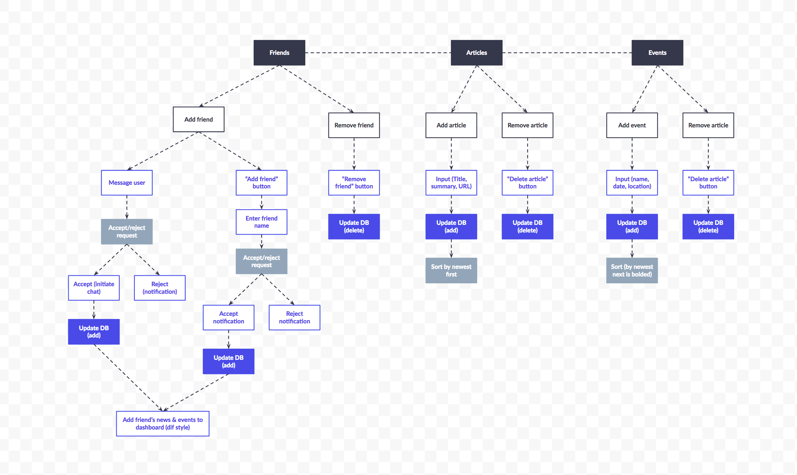
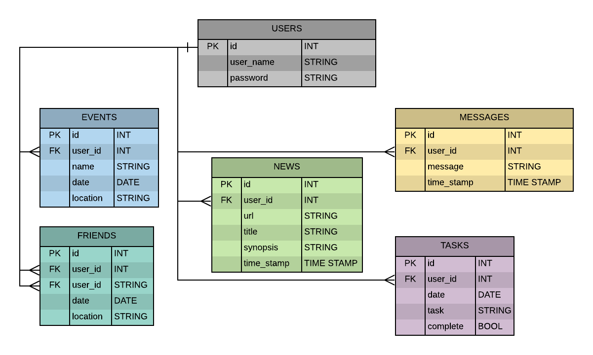

# Nutshell: The Information Dashboard

## Setup: Follow these steps exactly

1. Clone this repository
1. `cd` into the directory it creates
1. In the `api` directory, create a copy of the `database.json.example` and remove the .example extension.
1. Run `npm install` and wait for all dependencies to be installed
1. Run `npm start` to verify that installation was successful.

## Instructions

Nutshell is a new product offering that you have been tasked with building. It's a dashboard for people to use to organize their daily tasks, events, news article, friends, and chat messages.

You will be utilizing all of the skills and concepts that you've learned up to this point in the course.

1. Functions
1. Databases/API ([JSON Server Documentation](https://github.com/typicode/json-server))
1. Github
1. Objects
1. CSS/Flexbox
1. Array methods
1. Handling user events
1. Factory functions
1. Implementing CRUD operations
1. Modular code with Webpack
1. Relational data

To start you off, here's an example of what the resources in your API should look like once it's populated with some data from your application.

### Users

```json
{ "id": 1, "username": "Steve", "email": "me@me.com" }
```

### Messages

```json
{ "id": 1, "userId": 1, "message": "What's up?" }
```

### News

```json
{
    "id": 1,
    "userId": 2,
    "url": "https://www.quantamagazine.org/newfound-wormhole-allows-information-to-escape-black-holes-20171023/",
    "title": "Wormholes Allow Information to Escape Black Holes",
    "synopsis": "Check out this recent discovery about workholes"
}
```

### Friends

```json
{ "id": 1, "userId": 1, "loggedInUserId": 3 }
```

### Tasks

```json
{ "id": 1, "userId": 3, "task": "Take out garbage" }
```

## Professional Requirements

1. All teammates must be using Webpack to compile their code.
1. Each module should have a comment at the top with the following info: author(s) and purpose of module
1. The README for your project should include instructions on how another person can download and run the application
1. An ERD showing the database relationships. A screenshot/image should be included on your README.

## How to Handle Authentication

Be very clear that what you will be implemting is not real authentication. It is a simulation of it using very simplistic tools.

You will be using session storage to keep track of which user has logged into Nutshell. When the user fills out the registration form, you will POST their username and password to the `users` collection in your API. You will then immediately take the `id` of the object in the response and save it to session storage.

```js
sessionStorage.setItem("activeUser", user.id)
```

If you want to add a Logout feature, all you need to do it remove the session storage item.

```js
sessionStorage.removeItem("activeUser")
```

## Visual Feature List

To help you along, here is a visualization of a few features, as envisioned by one of your predecessors.



## Keep in mind some tips for a good usable app
1. Use acceptable conventions
   * Logo positioned at top left
   * Navigation across the top or down the left side
2. Visual hierarchy
   * Most important information is the most prominent
3. Break pages up into defined sections
   * Logically related content should be related visually
4. That which is clickable should be obviously clickable.
5. Eliminate distractions
   * Use only two typefaces
   * Limit color pallet (3 colors with black and white)
   * Use a grid
6. Support scanning (users don't read)
   * Use plenty of headings
   * Short paragraphs
   * Bulleted lists
7. Strive for consistency.

# Nutshell - CallBack-Cats
A dashboard application for oranizing your life and keeping up with friends.


## Download Instructions
● Follow this link → [NutShell Repository](https://github.com/Callback-Cats/nutshell)

● Fork to your GitHub account

● Clone with SSH, Use a password protected SSH key.  


## Contributing
Pull requests are welcome. For major changes, please open an issue first to discuss what you would like to change.

Please make sure to update tests as appropriate.


## ERD
This is our ERD!



